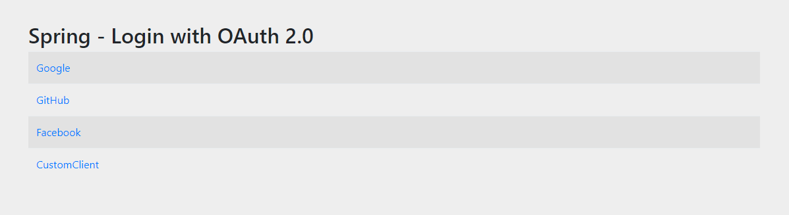

# Oauthsocial
Aplicação spring com login Oauth Social.
Nessa aplicação é feito o login utilizando o Google, GitHub e Facebook

#### Para testar a aplicação com um dos provedores será necessário criar uma configuração no provedor no qual deseja realizar os testes
1. **Google**=https://developers.google.com/identity/protocols/oauth2
2. **Github**=https://docs.github.com/pt/rest/apps/oauth-applications
3. **Facebook**=https://developers.facebook.com/

##### Exemplo das opções

